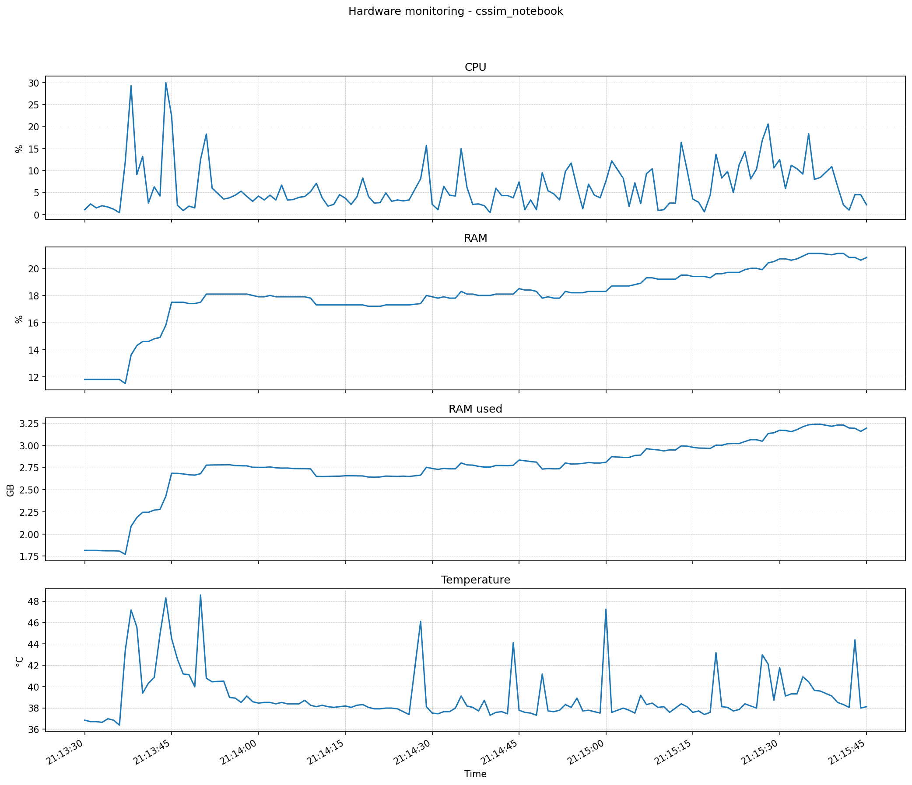

# Hardware usage report - cssim_notebook

## Session
- Start: 2026-04-05T21:13:29-03:00
- End: 2026-04-05T21:15:45-03:00
- Sampling interval: 1.0 s
- Total samples: 132
- Raw data file: samples.csv
- JSON summary: summary.json
- Plot: hardware_metrics.png

## Averages and peaks

| Metric | Average | Peak | Peak time |
|---|---:|---:|---|
| CPU | 6.296 % | 30.0 % | 2026-04-05T21:13:44-03:00 |
| RAM | 17.98 % | 21.1 % | 2026-04-05T21:15:35-03:00 |
| RAM used | 2.756 GB | 3.238 GB | 2026-04-05T21:15:37-03:00 |
| Swap | 0.0 % | 0.0 % | 2026-04-05T21:13:30-03:00 |
| Disk read | 0.0 MB/s | 0.004 MB/s | 2026-04-05T21:15:09-03:00 |
| Disk write | 0.142 MB/s | 1.353 MB/s | 2026-04-05T21:15:45-03:00 |
| Network sent | 0.175 MB/s | 3.479 MB/s | 2026-04-05T21:13:44-03:00 |
| Network received | 0.176 MB/s | 3.487 MB/s | 2026-04-05T21:13:44-03:00 |
| Temperature | 39.095 °C | 48.58 °C | 2026-04-05T21:13:50-03:00 |

## How to interpret
- Average values show the typical usage during the notebook session.
- Peak values show the highest observed value for each metric during the session.
- Disk and network rates are calculated in MB/s between consecutive samples.

## Plot

