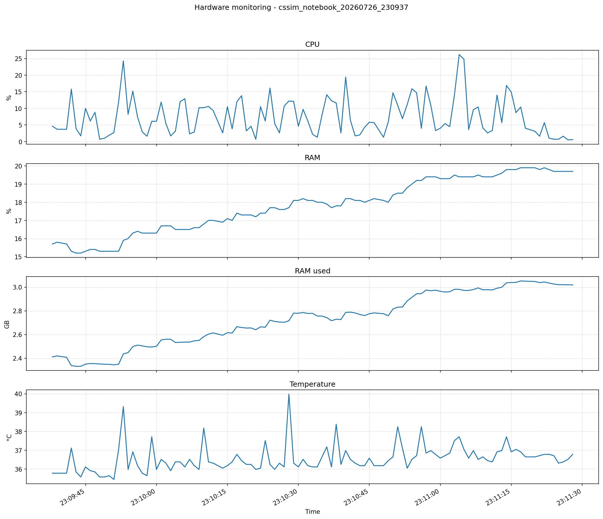

# Hardware usage report - cssim_notebook_20260726_230937

## Session
- Start: 2026-07-26T23:09:37-03:00
- End: 2026-07-26T23:11:28-03:00
- Sampling interval: 1.0 s
- Total samples: 107
- Raw data file: samples.csv
- JSON summary: summary.json
- Plot: hardware_metrics.png

## Averages and peaks

| Metric | Average | Peak | Peak time |
|---|---:|---:|---|
| CPU | 7.522 % | 26.2 % | 2026-07-26T23:11:04-03:00 |
| RAM | 17.808 % | 19.9 % | 2026-07-26T23:11:17-03:00 |
| RAM used | 2.731 GB | 3.052 GB | 2026-07-26T23:11:17-03:00 |
| Swap | 31.1 % | 31.1 % | 2026-07-26T23:09:38-03:00 |
| Disk read | 0.008 MB/s | 0.791 MB/s | 2026-07-26T23:10:10-03:00 |
| Disk write | 0.098 MB/s | 0.679 MB/s | 2026-07-26T23:10:46-03:00 |
| Network sent | 0.156 MB/s | 1.224 MB/s | 2026-07-26T23:10:01-03:00 |
| Network received | 0.156 MB/s | 1.224 MB/s | 2026-07-26T23:10:01-03:00 |
| Temperature | 36.566 °C | 39.98 °C | 2026-07-26T23:10:28-03:00 |

## How to interpret
- Average values show the typical usage during the notebook session.
- Peak values show the highest observed value for each metric during the session.
- Disk and network rates are calculated in MB/s between consecutive samples.

## Plot

